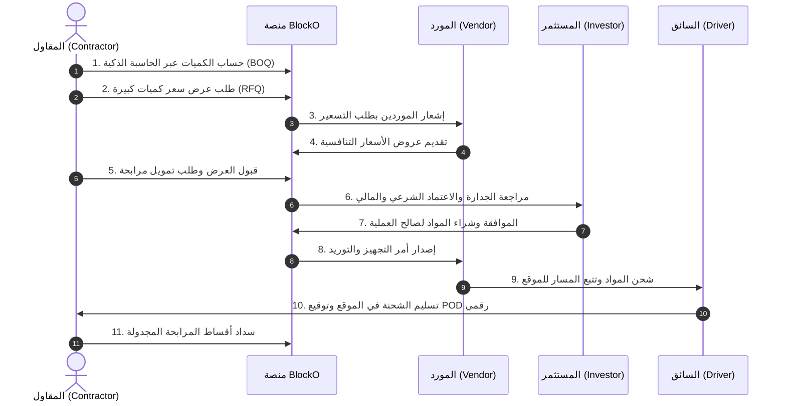

# 🏗️ وثيقة متطلبات المنتج الشاملة (Comprehensive Business PRD)
## منصة BlockO — السوق الرقمي الشامل لمواد البناء والتمويل الإسلامي والخدمات اللوجستية

---

## 1. الملخص التنفيذي والرؤية الاستراتيجية (Executive Summary & Product Vision)

### 1.1 الرؤية (Vision):
أن تصبح **BlockO** المنصة الرقمية القيادية الأولى في منطقة الشرق الأوسط وشمال أفريقيا لرقمنة سلسلة إمداد قطاع التشييد والبناء، من خلال الربط الذكي بين: **ملاك المشاريع (B2C)، شركات المقاولات (B2B)، مصانع وموردي مواد البناء (Vendors)، جهات وصناديق التمويل الإسلامي (Investors)، وشبكات النقل والخدمات اللوجستية (Fleet Logistics)** تحت مظلة تقنية موحدة وآمنة ومتوافقة مع الشريعة الإسلامية وأنظمة الفوترة الإلكترونية (ZATCA).

### 1.2 المشكلات التي تعالجها المنصة (Problem Statement):
1. **تذبذب وضبابية أسعار مواد البناء** وصعوبة الحصول على تسعير فوري وعادل للكميات الضخمة.
2. **أزمة السيولة والتدفقات النقدية لدى المقاولين** وغياب حلول تمويل رقمية متوافقة مع أحكام المرابحة الإسلامية.
3. **صعوبة حساب الكميات الإنشائية (BOQ)** لملاك المشاريع والمقاولين الناشئين بدقة، مما يؤدي إلى هدر مالي ومادي.
4. **تشتت سلاسل الإمداد اللوجستي** وتأخر توريد الشحنات إلى المواقع الإنشائية مع غياب التتبع الحي وإثبات الاستلام الرقمي (POD).
5. **الخلط بين تجربة شراء التجزئة (B2C) والتعاملات المؤسسية الكبرى (B2B)** في الفوترة والضرائب والخصومات.

---

## 2. مصفوفة الأدوار والصلاحيات (Role-Based Access Control - RBAC Matrix)

تعتمد المنصة هيكلية معمارية تعزل الواجهات والمسارات بحسب طبيعة المستخدم مع ضمان التكامل السلس:

| # | الدور (Role) | الفئة المستهدفة | مسار التسجيل (Onboarding) | الواجهة المخصصة (Portal) | طريقة الدفع والفوترة |
|---|---|---|---|---|---|
| **1** | **SuperAdmin / Admin** | الإدارة العليا وفرق العمليات | داخلي ومقيد بأمان عالي | `/Admin` | تحكم كامل بجميع البوابات والعمليات |
| **2** | **Vendor** | مصانع وتجار مواد البناء | `/Vendor/Account/Join` | `/Vendor` | تسويات مالية دورية، عمولات المنصة |
| **3** | **Contractor** | مؤسسات وشركات المقاولات | `/Shop/Contractor/Join` | مساحة أعمال المقاول `/Contractor` | تسهيلات ائتمانية، تمويل مرابحة، تحويل بنكي B2B |
| **4** | **Investor** | البنوك وصناديق التمويل | دعوة واعتماد مالي | `/Shop/Financing/InvestorDashboard` | إيداع وسحب محافظ تمويل، أرباح مرابحة |
| **5** | **Delivery Driver** | أسطول النقل والشاحنات | تسجيل واعتماد عبر النظام | تطبيق السائق `/Shop/Financing/DriverPOD` | أجور التوصيل ونسب النقل |
| **6** | **Customer** | الأفراد وملاك المنازل | `/Shop/Account/Register` | متجر التجزئة العام `/Shop` | مدى، فيزا، Apple Pay، تابي/تمارا (B2C) |

---

## 3. رحلات المستخدم التفصيلية (End-to-End User Journeys)



---

### 3.1 رحلة المقاول (B2B Contractor Journey):
1. **التسجيل والتحقق (B2B Onboarding & KYC):**
   - تسجيل بيانات المنشأة: اسم المؤسسة، رقم السجل التجاري (CR)، الرقم الضريبي (VAT)، ترخيص بلدي، شهادة تصنيف المقاولين، وبيانات المفوض بالتوقيع.
   - إسناد حالة `Pending_Verification` حتى مطابقة السجل التجاري، ثم منح شارة **"مقاول معتمد 🏗️"**.
2. **استخدام حاسبة تكاليف ومواد البناء الذكية (Smart BOQ Engine):**
   - إدخال مواصفات المشروع (سكني، تجاري، مسطحات البناء، عدد الأدوار).
   - توليد جدول كميات فوري يشمل: كميات الحديد (طن)، الأسمنت (كيس)، البلوك (ألف حبة)، الخرسانة الجاهزة ($م^3$)، مع احتساب تكلفة المصنعيات والتشطيبات وفق أسعار السوق اللحظية.
3. **طلب عروض أسعار للكميات الضخمة (Bulk RFQ):**
   - إرسال طلب تسعير مخصص للموردين في منطقة المشروع مع تحديد جدول التوريد الزمني.
   - استقبال العروض والمفاضلة بينها بناءً على السعر ووقت التسليم والتقييم.
4. **طلب التمويل بالمرابحة الإسلامية (Islamic Murabaha Financing):**
   - اختيار المواد المراد تمويلها وتحديد فترة السداد (من 3 إلى 24 شهراً).
   - إرفاق رخصة البناء وعقد المقاولة.
   - استعراض جدول الأقساط الشفاف ونسبة المرابحة المعلنة والمتوافقة مع الضوابط الشرعية.
5. **دخول المناقصات (Tenders & Bidding):**
   - استعراض المشاريع المطروحة من ملاك المباني والمطورين وتقديم العطاءات الفنية والمالية.

---

### 3.2 رحلة المورد ومصنع مواد البناء (B2B Vendor Journey):
1. **الانضمام وإعداد المستودعات:**
   - تسجيل بيانات المصنع/المستودع والمواقع الجغرافية ونطاق التغطية اللوجستية.
2. **إدارة المنتجات وأسعار الجملة:**
   - رفع الكتالوج مع تحديد الحد الأدنى للطلب (MOQ) وأسعار شرائح الجملة (Tiered Pricing).
   - ربط المخزون تلقائياً عبر API أو رفع شيتات Excel عبر مركز البيانات (Data Hub).
3. **معالجة طلبات الـ RFQ وأوامر الشراء:**
   - تقديم عروض تسعير فورية للطلبات الواردة من المقاولين.
   - استلام أوامر التجهيز فور تأكيد الدفع أو اعتماد تمويل المرابحة.
4. **الفوترة والتحصيل:**
   - إصدار فواتير ضريبية إلكترونية معتمدة، ومتابعة التحصيلات ومستحقات المبيعات في المحفظة المالية.

---

### 3.3 رحلة العميل الفردي (B2C Customer Journey):
1. **التسوق السلس والمباشر:**
   - تصفح أقسام التشطيبات، الأدوات، ومواد الديكور مع فلاتر ذكية وسرعة بحث فائقة.
2. **السلة والدفع الفوري:**
   - إضافة المنتجات لسلة التجزئة والدفع عبر بوابات الدفع الإلكتروني المعتمدة أو الشراء بالتقسيط للأفراد عبر (تابي / تمارا).
3. **تتبع الطلب المنزلي:**
   - استلام إشعارات لحظية عبر SMS والبريد وواتساب بحالة الشحنة حتى باب المنزل.

---

### 3.4 رحلة المستثمر وممول المرابحة (Investor Journey):
1. **إيداع رأس المال في محافظ التمويل:**
   - تغذية المحفظة الاستثمارية المخصصة لتمويل صفقات مواد البناء.
2. **دراسة واعتماد طلبات التمويل:**
   - الاطلاع على التقييم الائتماني للمقاول ومستندات المشروع وتكلفة المواد.
   - اعتماد التمويل وتحويل قيمة المواد مباشرة إلى حساب المورد (شراء شرعي حقيقي للمواد).
3. **تحصيل العوائد والأقساط:**
   - استلام أصل المبلغ مضافاً إليه هامش ربح المرابحة وفق جدول السداد الشهري مع تنبيهات التعثر.

---

### 3.5 رحلة السائق والأسطول اللوجستي (Logistics & Driver Journey):
1. **استلام إشعار الإرسالية:**
   - استلام تفاصيل بوليصة الشحن، موقع التحميل من المصنع، وموقع التفريغ في المشروع.
2. **الملاحة والتتبع المباشر (Live GPS Tracking):**
   - بث الإحداثيات الحية للمقاول والإدارة لضمان الالتزام بمواعيد الصب والتوريد الحساسة.
3. **إثبات الاستلام الرقمي (Proof of Delivery - POD):**
   - التحقق من المستلم عبر كود OTP أو التوقيع الرقمي على شاشة الجوال وتأكيد وزن وجودة الشحنة.

---

### 3.6 رحلة الإدارة والرقابة المركزية (SuperAdmin & Ops Journey):
1. **الحوكمة الشاملة:**
   - إدارة المستخدمين وتدقيق رخص وسجلات المقاولين والموردين (KYC Approval).
2. **الرقابة الشرعية والائتمانية:**
   - الإشراف على عقود المرابحة والتأكد من تملك المواد قبل بيعها للمقاولين امتثالاً لأحكام الشريعة.
3. **مركز الأمان وإدارة حركة البيانات (Security & Traffic Hub):**
   - مراقبة سجلات الزيارات، فحص الـ IPs المشبوهة، حظر الهجمات ومحاولات الـ Brute Force، وإدارة إعدادات النظام والبوابات.

---

## 4. الوحدات والأنظمة الوظيفية الرئيسية (Core Platform Modules)

```
┌────────────────────────────────────────────────────────────────────────┐
│                        BlockO Core Platform Architecture               │
├───────────────────┬───────────────────┬────────────────────────────────┤
│ 📐 Smart BOQ      │ 💼 B2B RFQ        │ 💰 Islamic Murabaha Engine     │
│ Calculator        │ & Bidding Engine  │ (Credit Scoring, Installments) │
├───────────────────┼───────────────────┼────────────────────────────────┤
│ 🏭 Vendor Multi-  │ 🚚 Logistics &    │ 🧾 ZATCA Phase 2               │
│ Tenant Portal     │ Fleet Live Track  │ E-Invoicing & Tax Engine       │
├───────────────────┼───────────────────┼────────────────────────────────┤
│ 🔔 SignalR Real-  │ 🛡️ Security & IP  │ 📊 Data Hub (Bulk Excel Import │
│ Time Event Bus    │ Firewall Defense  │ & Multi-Lingual AI Engine)     │
└───────────────────┴───────────────────┴────────────────────────────────┘
```

---

## 5. المتطلبات غير الوظيفية (Non-Functional Requirements)

1. **الأداء والسرعة (Performance):**
   - زمن استجابة الصفحات < 1.2 ثانية.
   - دعم التوسعية الأفقية لمعالجة آلاف طلبات الأسعار اللحظية.
2. **الأمان وحماية البيانات (Security & Compliance):**
   - حماية ضد هجمات CSRF, XSS, SQLi, و Rate Limiting على مستوى الـ IP وحسابات المستخدمين.
   - تشفير البيانات الحساسة وكلمات المرور وفق معايير Identity & Argon2 / PBKDF2.
   - التوافق مع متطلبات نظام حماية البيانات الشخصية (PDPL) في المملكة.
3. **الامتثال الضريبي والشرعي (Regulatory & Sharia Compliance):**
   - إصدار الفواتير بصيغ XML و PDF المتوافقة مع معايير ZATCA للمرحلة الثانية.
   - تدقيق مسار عقود المرابحة من الهيئة الشرعية لضمان صحة القبض الحقيقي والتسليم.
4. **التوفرية والموثوقية (High Availability):**
   - نسبة تشغيل 99.9% مع إدارة الوظائف الخلفية الثقيلة (استيراد المواد والترجمة الآلية) عبر **Hangfire**.

---

## 6. مؤشرات الأداء الرئيسية وخريطة الإطلاق (KPIs & Product Roadmap)

| المرحلة | الأهداف والميزات الرئيسية | مؤشر النجاح (KPI) |
|---|---|---|
| **Phase 1: Foundation (حالي)** | إتمام عزل الأدوار، حاسبة BOQ، بوابات الدفع، وإدارة الموردين | 100% نجاح في استقرار النظام وخلوه من أخطاء الصلاحيات |
| **Phase 2: B2B Growth** | إطلاق بوابة المقاولين المستقلة، محرك RFQ المتطور، والربط مع الموردين | انضمام أول 200 مقاول معتمد و 50 مصنع مواد بناء |
| **Phase 3: Fintech & Scale** | أتمتة موافقات تمويل المرابحة والربط المباشر مع شركات التقييم الائتماني (سمة) | تجاوز حجم التمويلات المنفذة 20 مليون ريال |

---
**وثيقة معتمدة وموجهة لفرق: إدارة المنتجات (PO)، هندسة البرمجيات (Tech Leads)، وفرق الأعمال والاستثمار.**
