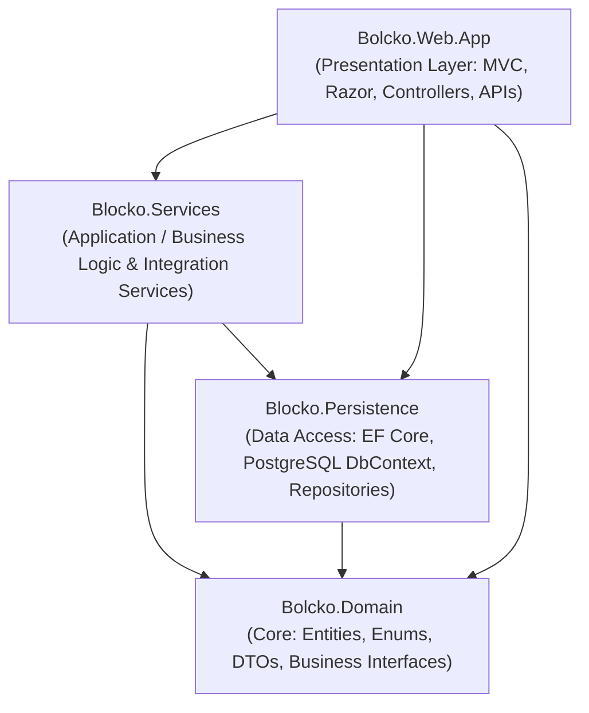

# Bolcko (بلوكو) - E-Commerce & B2B Procurement Platform

[](https://dotnet.microsoft.com/)
[](https://www.postgresql.org/)
[](https://aws.amazon.com/)
[](https://tailwindcss.com/)

**Bolcko (بلوكو)** is a modern, enterprise-grade B2B and B2C digital marketplace and procurement platform engineered for the construction, industrial tools, hardware, and fit-out supplies sector in the MENA region.

---

## 📑 Table of Contents (فهرس التوثيق)

1. [Architecture & Design Principles](#-architecture--design-principles)
2. [Project Structure](#-project-structure)
3. [Key Modules & Features](#-key-modules--features)
4. [Third-Party Integrations](#-third-party-integrations)
5. [AWS ALB & Cloud Health Probes](#-aws-alb--cloud-health-probes)
6. [Getting Started & Local Setup](#-getting-started--local-setup)
7. [Database & Migrations](#-database--migrations)
8. [Docker & Deployment](#-docker--deployment)
9. [Detailed Documentation Guides](#-detailed-documentation-guides)

---

## 🏛️ Architecture & Design Principles

Bolcko is built following **Clean Architecture (Onion Architecture)** and **SOLID** principles:



- **Separation of Concerns:** Business rules reside in `Blocko.Services`, decoupled from presentation and data persistence.
- **Dependency Inversion:** Interfaces declared in Domain/Services, registered in ASP.NET Core DI container.
- **Asset-Light Sourcing:** Direct automated supplier API dispatch without redundant warehouse lock-in.

---

## 📁 Project Structure

```
Bolcko.Web/
├── Bolcko.Domain/                 # Core Domain Entities, DTOs & Enums
│   ├── Entities/                  # Product, Order, Category, Supplier, User, Quote
│   └── Enums/                     # SourcingStatus, OrderStatus, SeoStatus
├── Blocko.Persistence/            # Data Access & Entity Framework Core
│   ├── Context/                   # ApplicationDbContext (PostgreSQL Npgsql)
│   ├── Migrations/                # Idempotent DB Migrations
│   └── Repositories/              # Generic & Specific Unit of Work Repositories
├── Blocko.Services/               # Application Business Logic & Integrations
│   ├── Implementations/
│   │   ├── Supplier/              # Dynamic Wholesaler API (Qannas Integration)
│   │   ├── Delivery/              # GLC Courier & Logistics Integration
│   │   ├── Orders/                # Order Management & Checkout Pipelines
│   │   ├── Cart/                  # Shopping Cart & Session Engine
│   │   └── Seo/                   # SEO & Metadata Automation
│   └── Interfaces/                # Service Contracts
├── Bolcko.Web.App/                # ASP.NET Core 8 Presentation Layer
│   ├── Areas/
│   │   ├── Shop/                  # Customer Facing Catalog, Cart, Checkout, Quotes
│   │   └── Admin/                 # Admin Dashboard, Products, Orders, Suppliers
│   ├── Controllers/               # Base Controllers & REST APIs
│   │   └── HealthController.cs    # AWS ALB Liveness & Readiness Probes
│   ├── Middlewares/               # Security, SEO, FirstRun, Health Check Bypasses
│   ├── Views/ & Shared/           # Modern Tailwind CSS Razor Views
│   └── wwwroot/                   # Static Assets (Images, Icons, CSS bundles)
└── docs/                          # Detailed Technical Guides
```

---

## ⚡ Key Modules & Features

### 1. Dual Commerce Engine (B2C & B2B)
- **Retail Storefront:** Fast, responsive product catalog with dynamic variant selection (Size, Color, Unit), faceted search, and instant cart.
- **B2B Bulk RFQ (Request for Quote):** Interactive digital quote engine allowing contractors and developers to request custom wholesale pricing with one click.

### 2. Dynamic Supplier Sourcing (Auto-Dispatch)
- Configurable supplier API integration (`ISupplierApiService`) with support for token caching, customer authentication, and payload dispatch.
- Integrated with major wholesalers (e.g. **Al-Qannas API**).
- Orders track `SourcingStatus` (`PendingSourcing`, `SentToSupplier`, `ConfirmedBySupplier`, `FailedToSource`).

### 3. Smart Logistics & Courier Dispatch
- Integrated with **GLC Express Delivery API**.
- Dynamic routing: Auto-selects courier pickup location (e.g. `عمان - رأس العين - مستودع القناص`) when an order is sourced from an external supplier.
- Automated shipping fee calculator with real-time tracking code generation.

### 4. Enterprise AWS Cloud Resilience
- Zero-overhead ALB health check probes returning lightweight JSON.
- Middleware bypasses ensuring health checks never pollute database analytics or get blocked by rate limiters.

---

## 🔌 Third-Party Integrations

| Provider | Purpose | Implementation Details |
| :--- | :--- | :--- |
| **Qannas Wholesaler API** | Automated Product Sourcing & Orders | `SupplierApiService.cs` (`/ar/api/Orders/Add`) |
| **GLC Express Delivery** | Courier Booking & Tracking | `DeliveryApiService.cs` (Pickup & Delivery Routing) |
| **PostgreSQL RDS** | High-reliability Relational Database | EF Core with Npgsql driver |
| **AWS Cloud (ECS / ALB / S3)** | Production Hosting & Media Storage | Dockerized container running on AWS ECS |

---

## 🩺 AWS ALB & Cloud Health Probes

Bolcko provides dedicated, non-blocking health endpoints designed for AWS Application Load Balancers, ECS Task Definitions, and Kubernetes:

| Endpoint | HTTP Method | Expected Output | Purpose |
| :--- | :---: | :--- | :--- |
| `/api/health` | `GET` | `{"status":"Healthy"}` (HTTP 200) | **ALB Target Group Liveness Probe** (Fastest, 0ms overhead, no UI) |
| `/health` | `GET` | `{"status":"Healthy"}` (HTTP 200) | Standard Health check alias |
| `/health/ready` | `GET` | `{"status":"Ready","database":"Connected"}` | **Readiness Probe** (Verifies DB connection & memory) |
| `/health/detail`| `GET` | Diagnostic Report (Uptime, RAM, DB Status, Counts) | Diagnostic overview for DevOps / Admin |

---

## 🛠️ Getting Started & Local Setup

### Prerequisites
- [.NET 8.0 SDK](https://dotnet.microsoft.com/download/dotnet/8.0)
- [PostgreSQL 14+](https://www.postgresql.org/download/)
- [Node.js](https://nodejs.org/) (for Tailwind CSS compiler)

### Step 1: Clone Repository
```bash
git clone https://github.com/QayimTech/Bolcko.Web.git
cd Bolcko.Web
```

### Step 2: Configure Database Connection
Update `Bolcko.Web.App/appsettings.json` or `appsettings.Development.json`:
```json
{
  "ConnectionStrings": {
    "DefaultConnection": "Host=localhost;Port=5432;Database=bolcko_db;Username=postgres;Password=your_password"
  }
}
```

### Step 3: Apply Database Migrations
```bash
dotnet ef database update --project Blocko.Persistence --startup-project Bolcko.Web.App
```

### Step 4: Run Application
```bash
dotnet run --project Bolcko.Web.App
```
Access the application at `https://localhost:7001` or `http://localhost:5000`.

---

## 🐳 Docker & Deployment

The application is containerized using multi-stage Docker builds:

```bash
# Build Docker Image
docker build -t bolcko-web:latest .

# Run Container
docker run -d -p 80:8080 \
  -e ConnectionStrings__DefaultConnection="Host=rds-host;Database=bolcko;Username=app;Password=secret" \
  --name bolcko-app bolcko-web:latest
```

---

## 📚 Detailed Documentation Guides

For comprehensive technical deep-dives, consult the files in `/docs`:
- 🏗️ [Architecture & Layers Guide](docs/ARCHITECTURE.md)
- 🔄 [Supplier & Delivery Integrations](docs/INTEGRATIONS.md)
- 🩺 [Health Check & Cloud Operations Guide](docs/API_AND_HEALTH.md)

---

## 👥 Contributors & Maintainers
- **Founder & Tech Lead:** Hamza Al-Ahmad
- **Organization:** Qayim Tech / Bolcko Operations Team
- **Website:** [www.block-o.com](https://www.block-o.com)\n