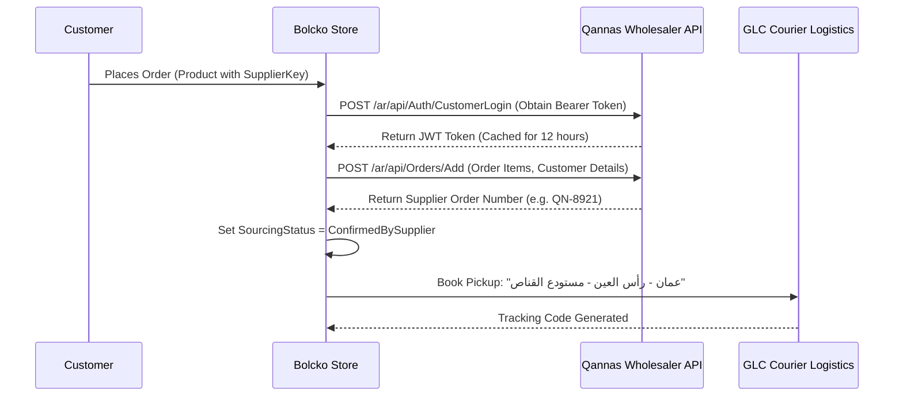

# Third-Party Integrations Guide

## 1. Dynamic Wholesaler Integration (Qannas API)

### Overview
Bolcko supports automated, just-in-time order dispatching to external supplier APIs. This removes the need for physical warehousing for supported supplier SKUs.

### Key Entities
- `SupplierProviderConfig`: Stores API base URL, API credentials, Customer Username/Password, and active status in the database.
- `SourcingStatus`: Enum tracking order dispatch (`PendingSourcing`, `SentToSupplier`, `ConfirmedBySupplier`, `FailedToSource`).

### Integration Flow

### Admin Configuration
Navigate to `Admin Area -> Supplier Settings` to configure supplier credentials, test authentication, and view dispatch logs.

---

## 2. Logistics & Delivery Integration (GLC Logistics)

### Dynamic Pickup Routing
When an order contains items fulfilled by external suppliers:
- Pickup Address: `عمان - رأس العين - مستودع القناص`
- Delivery Address: Customer Shipping Address
- Courier: GLC Express Delivery\n